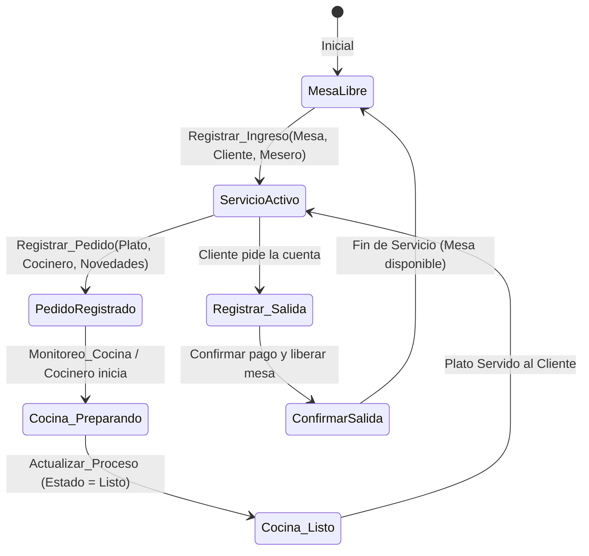
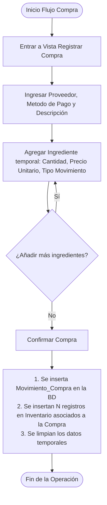

# MANUAL DE USUARIO ESTRUCTURADO PARA INTELIGENCIA ARTIFICIAL (IA)
## SISTEMA DE GESTIÓN DE POLLERÍA - ASP.NET CORE MVC

---

## 1. METADATOS DEL SISTEMA (SYSTEM METADATA)
```yaml
system_name: "Sistema de Gestión - Proyecto Pollería"
architecture: "ASP.NET Core MVC (Model-View-Controller)"
primary_language: "C# / HTML (Razor Views) / CSS (Vanilla CSS)"
database_pattern: "Repository Pattern con Services Layer"
domain: "Gastronomía / Restaurante de Pollo (Pollería)"
target_audience: "Desarrolladores, Agentes AI, Administradores del Sistema"
version: "1.0.0"
locale: "es-ES (Spanish)"
```

---

## 2. ARQUITECTURA DE ENTIDADES Y ESQUEMA DE DATOS (DATA SCHEMAS)
A continuación se definen los modelos de datos en formato de interfaces estructuradas de tipo TypeScript para facilitar su lectura e interpretación lógica por parte de cualquier modelo de lenguaje (LLM).

```typescript
// Roles del Personal dentro de la Pollería
interface Rol {
  id: number;          // Identificador único de rol
  nombre: string;      // Ej. "Mesero", "Cocinero", "Administrador"
}

// Empleados del Establecimiento
interface Trabajador {
  cc: string;          // Cédula de Ciudadanía (ID Primario - string)
  nombre: string;      // Nombre completo del trabajador
  telefono: string;    // Teléfono de contacto
  direccion: string;   // Dirección residencial
  salario: number;     // Salario mensual (double)
  rol: number;         // FK -> Rol.id
}

// Clientes del Restaurante
interface Cliente {
  cc: string;          // Cédula de Ciudadanía (ID Primario - string)
  nombre: string;      // Nombre completo del cliente
  telefono: string;    // Teléfono de contacto
  direccion: string;   // Dirección de entrega o residencia
}

// Proveedores de Insumos / Materia Prima
interface Proveedor {
  nit: string;         // NIT o ID Fiscal del Proveedor (ID Primario - string)
  nombre: string;      // Razón social / Nombre de la empresa
  direccion: string;   // Dirección fiscal / física
  telefono: string;    // Teléfono comercial de contacto
}

// Insumos o Ingredientes Base en Cocina/Inventario
interface Ingrediente {
  id: number;          // Identificador único (ID Primario)
  nombre: string;      // Nombre del ingrediente (Ej: "Pollo entero", "Papa Amarilla")
  descripcion: string; // Detalle o notas adicionales del insumo
  unidad_medida: string;// Unidad de empaque/medida (Ej: "Kg", "Unidades", "Litros")
}

// Registro Individual de Movimientos en Inventario
interface Inventario {
  id: number;                 // Identificador único (ID Primario)
  fecha: Date;                // Fecha y hora del movimiento
  cantidad: number;           // Cantidad movida (double)
  precio_unitario: number;    // Costo por unidad
  id_tipo_movimiento: number; // 1 = Ingreso (Entrada), 2 = Salida
  id_ingrediente: number;     // FK -> Ingrediente.id
  id_compra?: number;         // FK -> Movimiento_Compra.id (Opcional - solo si es por compra)
  nombre_ingrediente?: string;// Campo auxiliar de despliegue en vista
  tipo_movimiento_desc?: string;// Campo auxiliar de despliegue en vista
}

// Métodos de Pago Disponibles
interface MetodoPago {
  id: number;          // 1 = Efectivo, 2 = Tarjeta débito, 3 = Tarjeta crédito, 4 = Transferencia
  nombre: string;      // Descripción literal del método
}

// Documento / Registro General de Compra en Lote
interface Movimiento_Compra {
  id: number;                  // Identificador único del lote de compra
  id_proveedor: string;        // FK -> Proveedor.nit
  descripcion: string;         // Glosa o detalle explicativo de la compra
  id_metodo_pago: number;      // FK -> MetodoPago.id
  inventarios: Inventario[];   // Colección de registros individuales de insumos adquiridos
}

// Platos y Productos Ofrecidos en el Menú
interface Plato {
  id: number;          // Identificador único del plato
  nombre: string;      // Nombre comercial (Ej: "1/4 de Pollo a la Brasa")
  precio: number;      // Precio de venta final (decimal)
  descripcion: string; // Breve descripción o componentes principales
}

// Estado del Pedido en la Cocina (Flujo de Cocina)
interface Proceso {
  id: number;          // Identificador de estado
  descripcion: string; // Ej: "Recibido", "En preparación", "Listo para entregar"
}

// Registro de Mesa Física
interface Mesa {
  id: number;          // Número/Identificador de mesa
  descripcion: string; // Ej: "Mesa 1 - Primer Piso", "Mesa 2 - VIP"
}

// Servicio de Atención en Mesa (Ciclo de una mesa ocupada)
interface Servicio {
  id: number;               // Identificador del servicio activo
  hora_ingreso: Date;       // Registro de entrada del cliente al local
  hora_salida?: Date;       // Registro de facturación / salida del cliente (nullable)
  id_mesa: number;          // FK -> Mesa.id
  id_agenteservicio: string;// FK -> Trabajador.cc (Mesero que atiende)
  id_tipo_servicio: number; // Tipo de atención (Ej: Salón, Llevar)
  id_cliente: string;       // FK -> Cliente.cc
}

// Pedido Individual de Plato asociado a un Servicio Activo
interface Pedido {
  id: number;          // Identificador único del pedido
  novedad: string;     // Especificaciones especiales (Ej: "Sin papas", "Bien cocido")
  precio: number;      // Precio del plato en el momento del pedido (decimal)
  id_proceso: number;  // FK -> Proceso.id (Estado de la preparación en cocina)
  id_cocinero: string; // FK -> Trabajador.cc (Cocinero a cargo)
  id_servicio: number; // FK -> Servicio.id
  id_plato: number;    // FK -> Plato.id
}
```

---

## 3. FLUJOS DE TRABAJO E INTERACCIÓN (WORKFLOW STATE MACHINES)

El sistema opera bajo tres macro-flujos claramente definidos. Las inteligencias artificiales deben entender estas transiciones de estado para resolver problemas u operar el sistema eficientemente.

### FLUJO A: Gestión del Ciclo del Cliente y Ventas (Salón / Mesa)
Representa la experiencia de un cliente en mesa desde que llega hasta que se retira del local:



1. **Apertura de Mesa (Ingreso)**: 
   - **Precondición**: La mesa seleccionada debe estar libre. El mesero y el cliente deben existir en el sistema.
   - **Acción**: `Gestion_Movimiento_Venta/Registrar_Ingreso` crea un registro en `Servicio` con `hora_ingreso = DateTime.Now` y cambia el estado de la mesa a ocupada.
2. **Toma de Pedido (Pedido)**:
   - **Precondición**: Debe existir un `Servicio` activo para la mesa.
   - **Acción**: `Gestion_Movimiento_Venta/Registrar_Pedido` asocia un `Plato` a un `Servicio` activo, asigna un cocinero (`id_cocinero`) y establece el estado inicial del pedido (`id_proceso` inicial, ej: "Recibido").
3. **Control de Cocina (Monitoreo e Insumos)**:
   - **Precondición**: El pedido está en el listado activo.
   - **Acción**: Los cocineros ven el pedido en `Monitoreo_Cocina`. A medida que trabajan, cambian su estado mediante `Actualizar_Proceso/ActualizarEstado` a "En preparación" y finalmente "Listo".
4. **Cierre de Cuenta y Facturación (Salida)**:
   - **Precondición**: El cliente solicita retirarse.
   - **Acción**: En `Registrar_Salida` se calcula recursivamente el costo total del servicio sumando todos los pedidos asociados a este (`TotalPedido`). Al ejecutar `ConfirmarSalida`, se le asigna `hora_salida = DateTime.Now` al servicio y se libera la mesa físicamente en la base de datos.

---

### FLUJO B: Gestión y Llenado de Compras (Abastecimiento de Insumos)
Representa el proceso por el cual el restaurante compra ingredientes y materias primas a los proveedores registrados, ingresando el inventario correspondiente de forma masiva:



- **Acción Inicial (Formulario de Cabecera)**: Se accede a `/Gestion_Movimiento_Compra/Registrar`. Se ingresa el NIT del proveedor y el método de pago. Al guardar, se activa el formulario dinámico interno para los detalles.
- **Acción Intermedia (Agregar Pedido Temporal)**: Se utiliza `/Gestion_Movimiento_Compra/AgregarPedido`. Cada vez que se agrega un ingrediente, se genera de manera transitoria un objeto `Inventario` en una lista temporal estática en el controlador (`Movimiento_CompraTemp`).
- **Confirmación Final (Guardado)**: Se llama a `/Gestion_Movimiento_Compra/Confirmar`. Esto impacta la base de datos de manera atómica, insertando la cabecera en `Movimiento_Compra` e iterando la lista para crear cada registro correspondiente en `Inventario` vinculándolo con el `id_compra` generado.

---

### FLUJO C: Control Directo de Inventario (Entradas/Salidas Manuales)
Para movimientos directos que no provienen necesariamente de una compra a proveedor (ej: descartes por merma, robo, donación o ajustes manuales):

1. **Registrar Movimiento**: En `/Gestion_inventario/Registrar`, se selecciona un ingrediente, cantidad, precio unitario y tipo de movimiento (`1 = Ingreso`, `2 = Salida`).
2. **Validación Crítica**: 
   - **Regla**: Si el tipo de movimiento es una `Salida` (`2`), el sistema verifica que la cantidad a retirar no sea superior al stock neto existente en inventario del ingrediente en cuestión.
   - **Respuesta de Error**: En caso de exceder el stock disponible, se devuelve `"Se excede el inventario"`, interrumpiendo la inserción de manera segura.

---

## 4. MAPA DE CONTROLADORES, VISTAS Y PARÁMETROS (API/ROUTE MAP)

Esta sección permite a una IA ubicar las rutas del sistema, los métodos HTTP requeridos, los payload estructurados y el comportamiento/efecto esperado de las vistas.

### 4.1. Módulo: Gestión de Inventario (`Gestion_inventarioController`)
| Acción / Vista | Método HTTP | Parámetros del Formulario / Query String | Propósito / Efecto del Sistema |
| :--- | :--- | :--- | :--- |
| `Registrar` | **GET** | *Ninguno* | Carga el formulario de creación. Llena `ViewBag.ingredientes`. |
| `Registrar` | **POST** | `Inventario inv`, `int id_tipo_movimiento` | Registra un movimiento directo en la BD. Si la salida excede el stock, retorna error: *"Se excede el inventario"*. |
| `Consultar` | **GET** | *Ninguno* | Lista todos los registros históricos de movimientos de inventario en una tabla. |
| `Actualizar` | **GET** | `int? id_buscar` (Opcional) | Busca un movimiento de inventario por ID para editar. Llena la vista si existe. |
| `Actualizar` | **POST** | `Inventario inv` | Actualiza la cantidad, ingrediente o valores de un movimiento. Actualiza la fecha a `DateTime.Now`. |
| `Eliminar` | **GET** | *Ninguno* | Muestra vista de confirmación para eliminar. |
| `Eliminar` | **POST** | `int id` | Remueve permanentemente un registro de movimiento de la BD por su ID. |

---

### 4.2. Módulo: Compras de Insumos (`Gestion_Movimiento_CompraController`)
| Acción / Vista | Método HTTP | Parámetros del Formulario | Propósito / Efecto del Sistema |
| :--- | :--- | :--- | :--- |
| `Registrar` | **GET** | *Ninguno* | Inicializa un contenedor temporal estático `Movimiento_CompraTemp` para almacenar insumos antes del guardado. |
| `Registrar` | **POST** | `Movimiento_CompraTemp nuevo` | Establece la cabecera (proveedor, método de pago) y activa la adición de artículos. |
| `AgregarPedido`| **POST** | `int id_ingrediente`, `double cantidad`, `double precio_unitario`, `int id_tipo_movimiento` | Añade un ingrediente de forma transitoria a la lista interna del lote. |
| `Confirmar` | **POST** | *Ninguno* | Graba en base de datos la cabecera `Movimiento_Compra` e inserta simultáneamente todos los registros agregados en `Inventario` referenciando esta compra. |
| `Consultar` | **GET** | *Ninguno* | Retorna la lista total de compras de cabecera realizadas a proveedores. |
| `DetallePedidos`| **GET** | `int id` (Id de la compra) | Lista pormenorizada de todos los insumos de inventario que fueron ingresados en la compra seleccionada. |
| `Actualizar` | **GET** | `int? id` | Obtiene una compra por ID para editar su cabecera. |
| `Actualizar` | **POST** | `Movimiento_Compra compra` | Actualiza la información de cabecera de la compra. |
| `Eliminar` | **POST** | `int id` | Elimina la compra seleccionada. |

---

### 4.3. Módulo: Gestión del Servicio y Ventas (`Gestion_Movimiento_VentaController`)
| Acción / Vista | Método HTTP | Parámetros del Formulario | Propósito / Efecto del Sistema |
| :--- | :--- | :--- | :--- |
| `Registrar_Ingreso` | **GET** | *Ninguno* | Lista las mesas libres y los meseros en dropdowns para iniciar un servicio. |
| `Registrar_Ingreso` | **POST** | `Registrar_IngresoTemp tmp` | Inicia el servicio en BD para la mesa asociada asignando al cliente e identificando al mesero. |
| `Registrar_Pedido` | **GET** | *Ninguno* | Carga listas desplegables de servicios activos, platos del menú y cocineros. |
| `Registrar_Pedido` | **POST** | `Registrar_PedidoTemp tmp` | Asocia un nuevo plato ordenado a un servicio activo. Su estado de preparación arranca como "Recibido". |
| `Monitoreo_Cocina` | **GET** | *Ninguno* | Panel en tiempo real para cocineros que muestra los pedidos pendientes de preparación con sus detalles. |
| `Actualizar_Proceso` | **GET** | *Ninguno* | Muestra interfaz para filtrar pedidos activos por mesa y cambiar sus estados de preparación. |
| `ActualizarEstado` | **POST** | `Actualizar_ProcesoTemp tmp` | Actualiza el estado (`id_proceso`) del pedido (ej. de "Recibido" a "Listo para entregar"). |
| `Registrar_Salida` | **GET** | *Ninguno* | Muestra buscador y dropdown de servicios activos para generar la facturación. |
| `Registrar_Salida` | **POST** | `Servicio ser` | Busca y calcula de forma agregada el monto total gastado por los pedidos asociados a este servicio. |
| `ConfirmarSalida` | **POST** | `Servicio ser` | Cierra el servicio en la base de datos (guarda `hora_salida = DateTime.Now`), procesa el pago y libera la mesa para nuevos clientes. |
| `Consultar_Servicios`| **GET** | *Ninguno* | Historial completo de servicios completados en el restaurante. |
| `DetallePedido` | **GET** | `int idServicio` | Vista de auditoría que lista cada plato consumido durante el servicio consultado y la sumatoria acumulada. |

---

### 4.4. Módulos Maestros CRUD (Clientes, Trabajadores y Proveedores)
Estos controladores administran los catálogos y entidades principales. Operan con la ruta estructurada estándar: `/Gestion_[entidad]/[Accion]`.

```yaml
Rutas Maestras:
  Clientes:
    Registrar:  POST /Gestion_cliente/Registrar      -> Recibe { cc, nombre, telefono, direccion }
    Consultar:  GET  /Gestion_cliente/Consultar      -> Lista todos los clientes registrados
    Actualizar: POST /Gestion_cliente/Actualizar     -> Recibe { cc, nombre, telefono, direccion }
    Eliminar:   POST /Gestion_cliente/Eliminar       -> Recibe { id } (cc)
  Trabajadores:
    Registrar:  POST /Gestion_trabajador/Registrar   -> Recibe { cc, nombre, telefono, direccion, salario, rol }
    Consultar:  GET  /Gestion_trabajador/Consultar   -> Lista todo el personal
    Actualizar: POST /Gestion_trabajador/Actualizar  -> Recibe { cc, nombre, telefono, direccion, salario, rol }
    Eliminar:   POST /Gestion_trabajador/Eliminar     -> Recibe { cc }
  Proveedores:
    Registrar:  POST /Gestion_proveedor/Registrar    -> Recibe { nit, nombre, direccion, telefono }
    Consultar:  GET  /Gestion_proveedor/Consultar    -> Lista todos los proveedores de insumos
    Actualizar: POST /Gestion_proveedor/Actualizar   -> Recibe { nit, nombre, direccion, telefono }
    Eliminar:   POST /Gestion_proveedor/Eliminar     -> Recibe { nit }
```

---

## 5. GUÍA LÓGICA DE PROGRAMACIÓN Y VALIDACIONES (BUSINESS RULES)

Al interactuar o modificar este código, una IA debe regirse obligatoriamente por las siguientes directivas de lógica de negocio y restricciones físicas:

1. **Gestión de Stock de Inventario**:
   - **Fórmula de Stock Neto**: El stock físico real de un ingrediente es $\sum(\text{Ingresos}) - \sum(\text{Salidas})$.
   - **Operaciones de Descuento Automático**: En una venta real, la preparación de un plato consume insumos del inventario de acuerdo con las especificaciones técnicas parametrizadas en la tabla `Receta`. Una IA que gestione o automatice pedidos debe simular o descontar el equivalente de la receta.
2. **Métodos de Pago Restringidos**:
   Los identificadores del tipo de pago están estrictamente acoplados al modelo relacional. No se permiten cadenas libres de texto en este campo:
   - `1` = Efectivo
   - `2` = Tarjeta débito
   - `3` = Tarjeta crédito
   - `4` = Transferencia
3. **Flujo de Cocina y Estados de Pedidos**:
   Los estados del proceso de los pedidos deben avanzar de manera estrictamente secuencial. No es coherente pasar un pedido de estado "Recibido" directamente a "Entregado" sin pasar por la fase de cocina, a menos que sea un producto pre-elaborado (ej: Bebidas).
4. **Ciclo de Servicio en Mesa**:
   - No se puede asociar un `Pedido` a un `Servicio` cuya `hora_salida` ya se encuentre establecida (servicio archivado/cerrado).
   - No se puede liberar o utilizar una `Mesa` si ya está vinculada a un servicio cuya `hora_salida` sea nula (`NULL`).

---

## 6. INSTRUCCIONES DE SOPORTE E INTERACCIÓN PARA AGENTES IA (AI PLAYBOOK)

Esta sección provee comandos y directivas operativas útiles para que un Agente IA (o tú mismo en turnos posteriores) interactúe de forma programática con el código de la Pollería.

### 6.1. ¿Cómo realizar tareas de depuración en este código?
- **Validación del Servicio del Inventario**: Si el controlador de inventario reporta discrepancias al guardar salídas, inspecciona inmediatamente [InventarioService.cs](file:///c:/Users/krate/OneDrive/Documentos/Quinto_semestre/Programacion_Web/Proyecto_Polleria/Proyecto_Polleria/Services/InventarioService.cs) en su método `Crear`. Asegúrate de que el validador esté consultando correctamente el balance acumulado antes de autorizar la transacción.
- **Validación de la Factura de Salida**: Si al facturar el precio acumulado de los platos es incorrecto o da `0`, verifica el método `TotalPedido` ubicado en [Registrar_IngresoService.cs](file:///c:/Users/krate/OneDrive/Documentos/Quinto_semestre/Programacion_Web/Proyecto_Polleria/Proyecto_Polleria/Services/Registrar_IngresoService.cs). Este debe estar ejecutando un `JOIN` correcto con la entidad `Plato` para tomar el precio unitario guardado históricamente al tomar la orden.

### 6.2. Plantillas JSON de Carga de Datos Útiles para Automatización y Pruebas
Si necesitas inyectar datos falsos en la base de datos o realizar llamadas mock a los servicios en pruebas automatizadas, utiliza las siguientes estructuras JSON exactas:

#### Crear un Nuevo Cliente (POST `/Gestion_cliente/Registrar`)
```json
{
  "cc": "1002345678",
  "nombre": "Mariana Gómez Ortiz",
  "telefono": "3158765432",
  "direccion": "Calle 45 #12-89, Barrio El Prado"
}
```

#### Registrar Movimiento de Compra Masiva (Lote)
```json
{
  "id_proveedor": "800.123.456-1",
  "descripcion": "Abastecimiento mensual de Pollo y Papa de primera calidad",
  "id_metodo_pago": 1,
  "inventarios": [
    {
      "cantidad": 150.0,
      "precio_unitario": 8500.00,
      "id_tipo_movimiento": 1,
      "id_ingrediente": 3
    },
    {
      "cantidad": 200.0,
      "precio_unitario": 2200.00,
      "id_tipo_movimiento": 1,
      "id_ingrediente": 5
    }
  ]
}
```

---

*Manual de usuario y sistema optimizado para su interpretación lingüística por Inteligencias Artificiales de la familia Gemini, GPT, Claude, y motores de automatización de código.*
